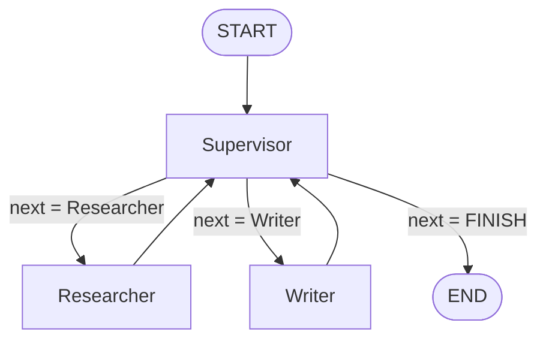
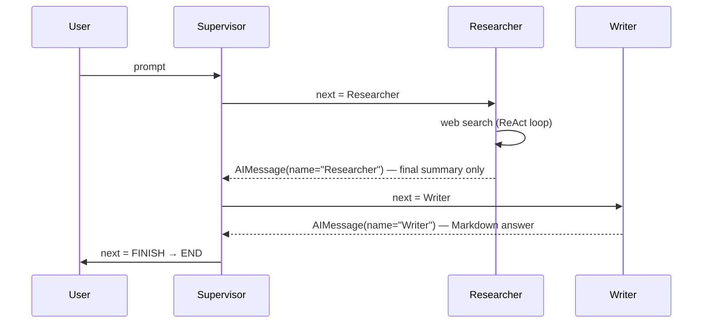

# Architecture

## Design goals

1. **Clean layering** — domain logic never touches external SDKs directly.
2. **Dependency injection** — one composition root; everything else receives collaborators.
3. **12-factor config** — all tunables from the environment, validated at startup.
4. **Testable offline** — the graph runs end-to-end with fakes; no key, no network.

## Layers

```
interfaces/   delivery mechanisms (CLI, HTTP API) — own all I/O
    │
    ▼
graph/        domain wiring: assemble + compile the workflow
    │
    ▼
agents/  tools/   adapters to the outside world (Gemini, DuckDuckGo)

constants/ config/ llm/ logging/ state   ← cross-cutting support any layer may read
```

Dependencies point **downward only**. `agents/`, `tools/`, and `graph/` never import `ChatGoogleGenerativeAI` or read `get_settings()` themselves — they receive already-built runnables and concrete values. This is what keeps the domain pure and the graph testable.

## Package map (`src/app/`)

| Module | Responsibility |
|--------|----------------|
| `constants.py` | `AgentName` enum — **single source of truth** for the worker roster; derives `MEMBERS` and `ROUTE_OPTIONS`. |
| `config.py` | `Settings` (pydantic-settings) + cached `get_settings()`. All configuration. |
| `llm.py` | `build_chat_model(role, settings)` — the **only** place a Gemini client is constructed. |
| `logging_config.py` | `configure_logging(settings)` — text or JSON; called once per interface. |
| `state.py` | `AgentState` TypedDict; the `messages` reducer is `operator.add` (append). |
| `tools/search.py` | `build_search_tool(settings)` — DuckDuckGo results tool. |
| `agents/supervisor.py` | Router: `RouteResponse` schema, `build_supervisor_runnable`, `make_supervisor_node`. |
| `agents/researcher.py` | ReAct agent with search: `build_researcher_agent`, `make_researcher_node`. |
| `agents/writer.py` | Toolless synthesis chain: `build_writer_agent`, `make_writer_node`. |
| `graph/dependencies.py` | `GraphDependencies` dataclass + `build_dependencies(settings)` — the **composition root**. |
| `graph/builder.py` | `build_graph(deps)` — wires nodes and edges, compiles the `StateGraph`. |
| `interfaces/cli.py` | `main(argv)` — argparse, fail-fast, prints the final answer. |
| `interfaces/api.py` | `create_app(settings)` — FastAPI + LangServe routes at `/research`. |

## The build/adapter pattern

Each agent module splits into two functions:

- **`build_*` (pure factory)** — takes injected collaborators (an LLM, tools), returns a LangChain `Runnable`. No I/O, no config lookup.
- **`make_*_node` (adapter)** — wraps a runnable as a LangGraph node: `(state) -> {partial state}`.

```
build_chat_model(role, settings) ─┐
                                  ├─► build_researcher_agent(llm, tools) ─► make_researcher_node(agent) ─► graph node
build_search_tool(settings) ──────┘
```

This split is the seam that lets tests inject a fake runnable in place of a real model.

## Control flow

`build_graph(deps)` compiles this topology:



- Entry is always the **Supervisor**.
- The supervisor (a `gemini-flash-lite-latest` router with **structured output** `RouteResponse`) writes only `state["next"]` — it never adds messages.
- A conditional edge routes on `state["next"]`: to a worker, or to `END` when `FINISH`.
- **Every worker edges back to the supervisor**, so it re-decides after each step.
- The loop is bounded by `settings.recursion_limit`, passed at invoke time (`{"recursion_limit": N}`).

A typical run:



## State and message contract

`AgentState` has two keys:

- `messages: Annotated[Sequence[BaseMessage], operator.add]` — the reducer **appends**, so every node returns `{"messages": [msg]}` (a list) to add to history rather than replace it.
- `next: str` — the supervisor's routing decision.

Message conventions that the routing and output depend on:

- Worker messages are tagged with `name=` (`"Researcher"` / `"Writer"`).
- The researcher node surfaces **only the ReAct agent's last message** — intermediate tool-call chatter is intentionally dropped from shared history.

## Two interfaces, one graph

Both entry points build the same graph via the same composition root:

```
Settings ─► build_dependencies(settings) ─► GraphDependencies ─► build_graph(deps) ─► compiled graph
                                                                                          │
                                          ┌───────────────────────────────────────────────┤
                                          ▼                                               ▼
                                interfaces/cli.py                               interfaces/api.py
                            (python main.py "…")                          (python serve.py → LangServe)
```

- **CLI** (`main.py` → `cli.main`): one prompt in, final Markdown answer to stdout — or to a file with `-o/--output PATH` (a `.md` extension is added if missing). The answer is taken from the last Writer-authored message; an empty answer is reported as an error rather than written. Diagnostics go through the logger.
- **API** (`serve.py` → `api.create_app`): FastAPI with LangServe routes under `/research` (`/invoke`, `/batch`, `/playground`, …) and a `/` redirect to `/docs`.

The root `main.py`/`serve.py` are thin launch shims that put `src/` on the path and call into `interfaces/`. See [development.md](development.md) for why they live at the root.

## Related docs

- Settings and env vars → [configuration.md](configuration.md)
- Testing the graph with fakes → [testing.md](testing.md)
- Conventions, invariants, adding an agent → [development.md](development.md)
